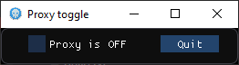

# ProxyToggle
A graphical quick and dirty tool used to toggle Windows system proxy ON or OFF that I exhumed from my old stuff. Checks status every 1/6th frame to fight against an eventual proxy set by system policy.

The (very) old source has been relatively untouched, but reworked to be compiled with clang and the latest release of imgui.
It still has the same shitty code and ergonomy, but still does the job.
Dependency : the GLFW libs (3.3)

